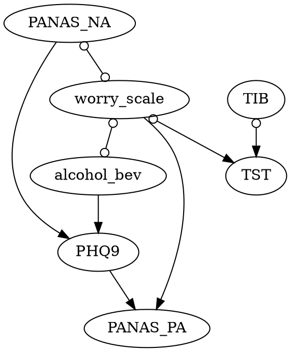
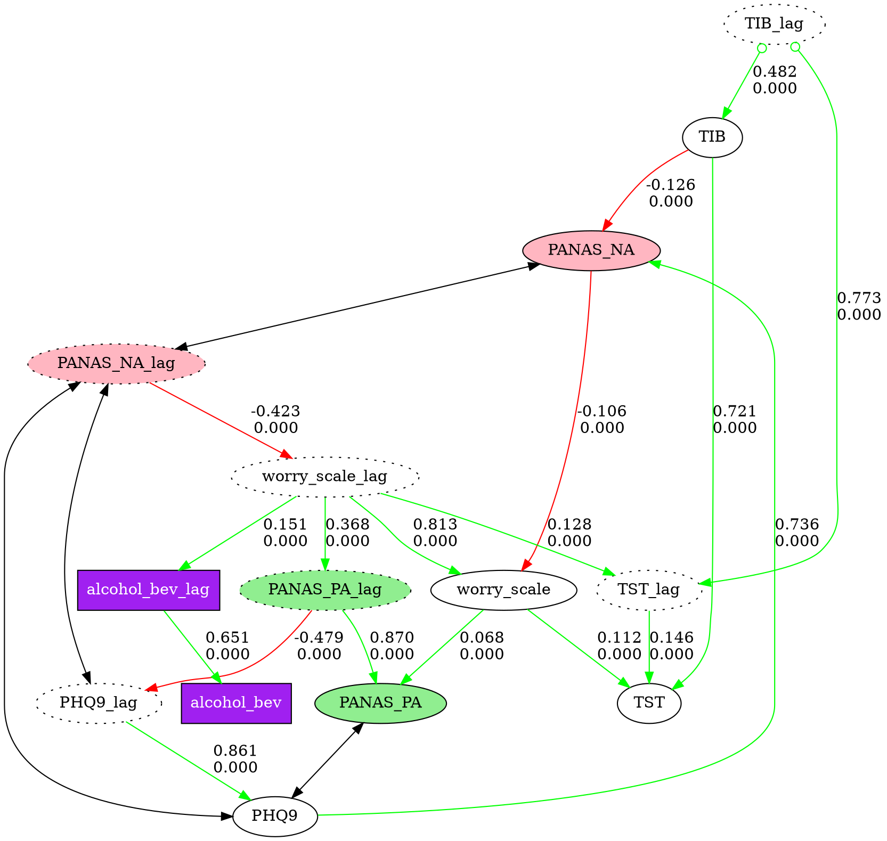

# fastcausal

Fast, easy-to-use causal discovery analysis tools for Python.

[](https://pypi.org/project/fastcausal/)
[](https://www.python.org/downloads/)
[](https://opensource.org/licenses/MIT)

## Overview

**fastcausal** provides a unified Python interface for causal discovery analysis, combining the functionality of several earlier packages into one pip-installable tool. It supports both interactive Jupyter notebook workflows and config-driven batch processing of large datasets.

Key features:

- **No Java dependency** — uses [tetrad-port](https://github.com/kelvinlim/tetrad-port) (C++ port of Tetrad algorithms) instead of Java
- **Seven causal discovery algorithms** — PC, FGES, GFCI, BOSS, BOSS-FCI, GRaSP, GRaSP-FCI
- **Prior knowledge support** — temporal tiers, forbidden/required edges
- **Bootstrapped stability analysis** — edge frequency selection across subsampled runs
- **SEM fitting** — automatic structural equation modeling via semopy
- **Flexible graph visualization** — node styling with fnmatch patterns, multi-graph comparison with shared layouts
- **Batch pipeline** — config-driven processing of hundreds of cases via CLI
- **Report generation** — automated Word document reports with embedded graphs

## Installation

```bash
pip install fastcausal            # core package
pip install fastcausal[sem]       # + SEM fitting (semopy)
pip install fastcausal[jupyter]   # + Jupyter/matplotlib/seaborn
pip install fastcausal[batch]     # + Word report generation
pip install fastcausal[all]       # everything
```

## Quick Start

Five lines to your first causal graph:

```python
from fastcausal import FastCausal

fc = FastCausal()
df = fc.load_sample("boston")          # bundled EMA dataset
results, graph = fc.run_search(df, algorithm="gfci", alpha=0.05)
fc.show_graph(graph)
```



### Time-series workflow with prior knowledge

For time-series data, add lagged columns, standardize, and encode temporal
ordering so that yesterday's values can only be causes (not effects) of today's:

```python
# Add lagged columns and standardize
lag_stub = "_lag"
df_lag = fc.add_lag_columns(df, lag_stub=lag_stub)
df_std = fc.standardize(df_lag)

# Build temporal prior knowledge explicitly:
# Tier 0 (lag vars) can only be parents of Tier 1 (current-day vars)
cols = df.columns
knowledge = {
    "addtemporal": {
        0: [col + lag_stub for col in cols],
        1: [col for col in cols],
    }
}

# Run GFCI causal discovery with SEM fitting
result, graph = fc.run_search(
    df_std,
    algorithm="gfci",
    alpha=0.01,
    penalty_discount=1.0,
    knowledge=knowledge,
)

# Visualize with custom node styles
node_styles = [
    {"pattern": "*_lag",        "style": "dotted"},
    {"pattern": "PANAS_PA*",    "style": "filled", "fillcolor": "lightgreen"},
    {"pattern": "PANAS_NA*",    "style": "filled", "fillcolor": "lightpink"},
    {"pattern": "alcohol_bev*", "shape": "box", "style": "filled",
     "fillcolor": "purple", "fontcolor": "white"},
]
fc.show_graph(graph, node_styles=node_styles)
```



See [`fastcausal_demo_short.ipynb`](fastcausal_demo_short.ipynb) for the full interactive demo.

## CLI Usage

fastcausal provides a command-line interface for batch processing:

```bash
# Data preparation
fastcausal parse --config proj/config.yaml

# Batch causal discovery across cases
fastcausal run --config proj/config.yaml
fastcausal run --config proj/config.yaml --start 0 --end 50
fastcausal run --config proj/config.yaml --list

# Effect size analysis and heatmaps
fastcausal paths --config proj/config.yaml

# Generate Word report
fastcausal report --config proj/config.yaml --mode 2wide

# Quick single-file analysis
fastcausal analyze data.csv --algorithm gfci --output results/
```

## Supported Algorithms

| Algorithm | Type | Output | Key Parameters |
|-----------|------|--------|----------------|
| **PC** | Constraint-based (Fisher Z) | CPDAG | `alpha` |
| **FGES** | Score-based (BIC) | CPDAG | `penalty_discount` |
| **GFCI** | Hybrid (FGES + FCI rules) | PAG | `alpha`, `penalty_discount` |
| **BOSS** | Permutation-based (BIC) | CPDAG | `penalty_discount` |
| **BOSS-FCI** | BOSS + FCI rules | PAG | `alpha`, `penalty_discount` |
| **GRaSP** | Permutation-based (tuck DFS) | CPDAG | `penalty_discount` |
| **GRaSP-FCI** | GRaSP + FCI rules | PAG | `alpha`, `penalty_discount` |

See the [Algorithm Guide](docs/algorithms.md) for detailed parameter reference, edge types, and selection guidance.

## Architecture

fastcausal consolidates four earlier codebases into a layered architecture:

```
pip install fastcausal
        |
    fastcausal  (API + CLI + viz + SEM + batch)
   /          \
tetrad-port    dgraph_flex
(C++ algorithms) (graph rendering)
```

- **tetrad-port** — C++ port of CMU Tetrad algorithms, exposed via nanobind
- **dgraph_flex** — Graphviz-based directed graph rendering

## Project Structure

```
fastcausal/
├── core.py              # FastCausal class (main API)
├── search.py            # Algorithm wrapper (PC, FGES, GFCI, BOSS, GRaSP, ...)
├── sem.py               # SEM fitting via semopy
├── transform.py         # Lag columns, standardization, subsampling
├── knowledge.py         # Prior knowledge handling
├── edges.py             # Edge parsing, selection, deduplication
├── cli.py               # Click-based CLI
├── viz/
│   ├── styling.py       # fnmatch-based node styling
│   ├── graphs.py        # Graph display and save (single + multi)
│   └── plots.py         # Heatmaps and effect size plots
├── pipeline/
│   ├── config.py        # YAML config parsing (v4.0 + v5.0)
│   ├── parse.py         # Data preparation engine
│   ├── batch.py         # Batch causal discovery
│   ├── paths.py         # Effect size analysis
│   ├── report.py        # Word document generation
│   └── metrics.py       # Graph metrics (centrality, ancestors)
└── io/
    ├── data.py           # CSV loading, sample datasets
    └── wearables.py      # Fitbit/Garmin integration (planned)
```

## Documentation

- [Algorithm Guide](docs/algorithms.md) — Algorithm selection, parameters, edge types, prior knowledge
- [Migration from fastcda](docs/migration_from_fastcda.md) — API mapping for fastcda users
- [Migration from cda_tools2](docs/migration_from_cda_tools2.md) — CLI mapping for cda_tools2 users
- [Consolidation Plan](ConsolidationPlan.md) — Implementation plan and phase status
- [Project Conventions](CLAUDE.md) — Development guidelines and conventions

## Config File Format

fastcausal uses YAML config files for batch processing. Version 5.0 is the current format; version 4.0 (from cda_tools2) is accepted with a deprecation warning.

```yaml
GLOBAL:
  version: 5.0
  name: my_project
  title: "My Causal Analysis"

CAUSAL:
  algorithm: gfci
  alpha: 0.05
  penalty_discount: 1.0
  knowledge: prior.txt
  standardize_cols: true
```

## Requirements

- Python >= 3.11
- [tetrad-port](https://github.com/kelvinlim/tetrad-port) >= 0.1.0
- [dgraph_flex](https://github.com/kelvinlim/dgraph_flex) >= 0.1.11
- [Graphviz](https://graphviz.org/) (system install for graph rendering)

## License

MIT

## Citation

If you use fastcausal in your research, please cite the relevant algorithm papers and this package.
